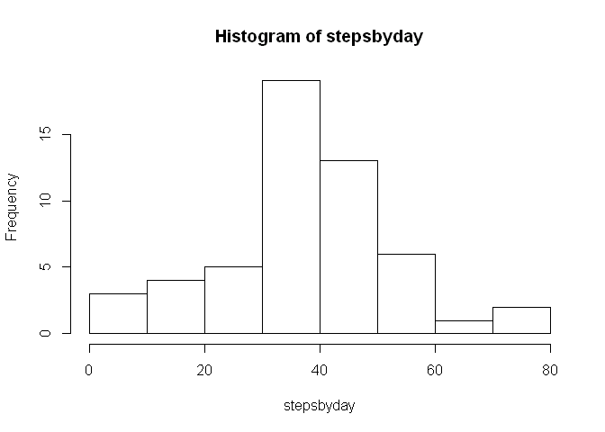
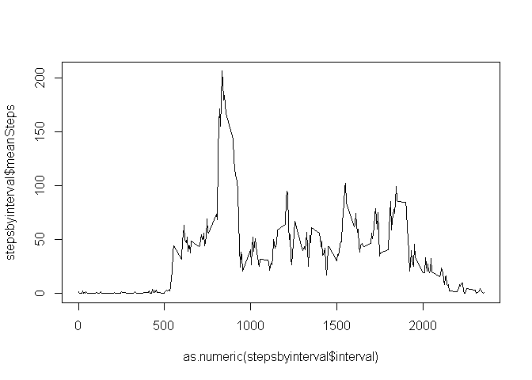
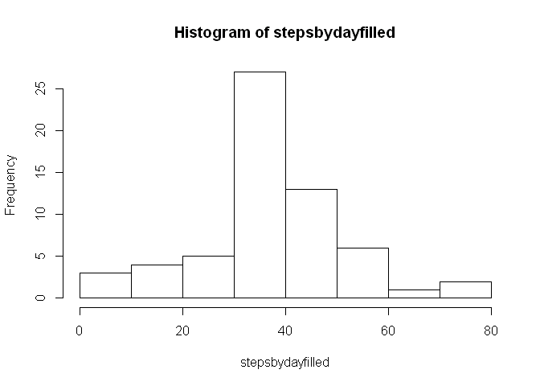
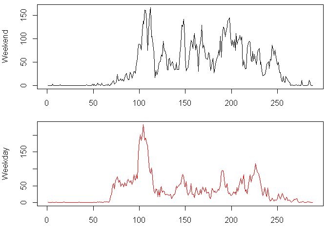

Reproducible Research: Peer Assessment 1
Tom Courtney
July 2014

Loading and preprocessing the data

```r
data<-read.csv("activity.csv", stringsAsFactors=FALSE)
data$date<-as.Date(data$date)
```


## What is mean total number of steps taken per day?

```r
stepsbyday<-tapply(data$steps, data$date, mean, na.rm=TRUE)
hist(stepsbyday)
```

 

```r
stepmean<-mean(stepsbyday,na.rm = TRUE)
stepmedian<-median(stepsbyday,na.rm=TRUE)
```
The MEAN steps per month is 37.3826.
The MEDIAN steps per month is 37.3785.

## What is the average daily activity pattern?

```r
stepsbyinterval<-data.frame(data$interval[1:288])
z<-tapply(data$steps,data$interval,mean, na.rm=TRUE)
stepsbyinterval<-cbind(stepsbyinterval,z)
colnames(stepsbyinterval)<-c("interval","meanSteps")
plot(as.numeric(stepsbyinterval$interval), stepsbyinterval$meanSteps,type="l")
```

 

```r
df2 <- stepsbyinterval[order(stepsbyinterval$meanSteps,decreasing=T),]
```
The Interval with the Maximum steps (averaged over all days), is 835.  
This max interval was found by sorting by steps then taking the first row. 

## Imputing missing values


```r
missing<-is.na(data$steps)
numbermissing<-sum(missing)
```
There are 2304 Missing values out of a total of 17568

Add an entire new column of imputed values from the Average by Interval calculation above.


```r
data[,"stepfilled"]<-data[,"steps"]
data$interval <- factor(data$interval)
data[missing,  "stepfilled"]  <-  stepsbyinterval[data[missing,  "interval"], "meanSteps"]
```


Make a histogram of the total number of steps taken each day and Calculate and report the mean and median total number of steps taken per day. Do these values differ from the estimates from the first part of the assignment? 

```r
stepsbydayfilled<-tapply(data$stepfilled, data$date, mean)
hist(stepsbydayfilled)
```

 

```r
stepmeanfilled<-mean(stepsbydayfilled,na.rm = TRUE)
stepmedianfilled<-median(stepsbydayfilled,na.rm=TRUE)
```

The MEAN steps per month (using imputed values for na's), is 37.3826.
The MEDIAN steps per month (using imputed values for na's), is 37.3785.

Oddly, the MEAN and the MEDIAN did NOT change.  This is quite a surprise! With 13% of the draw data missing I am very surprised. 

## Are there differences in activity patterns between weekdays and weekends?


```r
data$dayofweek <- "weekday"
weekend <- weekdays(as.Date(data$date)) %in% c("Saturday", "Sunday")
data$dayofweek[weekend == TRUE] <- "weekend"
data$dayofweek<-as.factor(data$dayofweek)


weekenddata <- subset(data, dayofweek == "weekend")
weekdaydata<-subset(data,dayofweek =="weekday")

weekdayMean <- aggregate(stepfilled ~ interval, data = weekdaydata, mean)
weekendMean <- aggregate(stepfilled ~ interval, data = weekenddata, mean)

library(ggplot2)

par(mfrow = c(2, 1),mar = c(3, 4, 0.5, 0.5))
weekendMean$interval<-as.numeric(weekendMean$interval)
plot(as.numeric(weekendMean$interval),as.numeric(weekendMean$stepfilled), type = "l", xlab = "Interval",ylab = "Weekend", col = "black")

plot(as.numeric(weekdayMean$interval),as.numeric(weekdayMean$stepfilled), type = "l", xlab = "Interval",ylab = "Weekday", col = "red")
```

 


Primary differences between Weekdays and Weekends:
- Weekdays show more activity in 60-80 interval range
- Weekend data is spikier.  This individual is probably more active on weekends than weekdays. 


